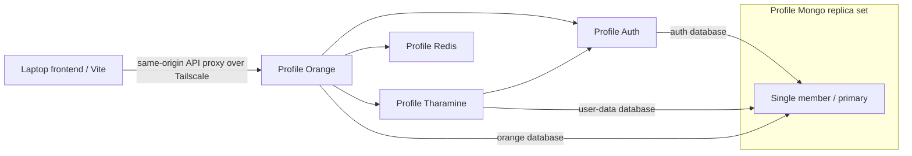

---
tags:
  - development
  - infrastructure
updated: 2026-10-01
status: Sean HDD runtime verified; Syncthing receiver ready; actual Mac pairing pending
---

# Per-profile frontend backends

## Current Sean rollout — 2026-10-01 (supersedes source placement and rollout order below)

Sean requested staying with his profile first and using an agent-facing runbook as the primary onboarding interface. See [[Chart Dev — Agent Onboarding]]; canonical source is `~/workspace/chart-infra/docs/AGENT-ONBOARDING.md`. Repository paths are explicit inputs discovered by the laptop agent, not a required `~/workspace` convention. The helper commands are optional building blocks for inspect/pair/resume/wait/pause.

The three active backend checkouts and their Linux dependency caches now run from `/mnt/hdd/shared-dev/profiles/sean/source/workspaces/pilot/` and `dependencies/`. Verified originals and SSD volumes remain retained. Empty source mirrors for pairing are under `source/mirrors/laptop/`. Only small Syncthing device/config state stays on SSD. Mongo and imported workspaces are unchanged; HDD watcher/data/identity checks passed.

A dedicated `chart-sean/syncthing` receiver is running at `100.66.127.115:22001`, with three receive-only folders **paused and unpaired**. Its identity/config/source volumes survived runtime teardown; exclusions, network isolation, existing OpenScape configuration and API health were verified. Actual Mac pairing, transfer/reconnect tests and activation of laptop mirrors still need to run on the Mac. The current apps continue using the working HDD pilot checkouts.

`chart apps select` now supports explicit prepared source/dependency selection with stopped apps, retained old volumes and guarded inputs. Synced sources also require a matching laptop checkpoint and paused owned folders. App/sync/Mongo teardown are currently separate commands; each retains its data/identity/volumes. Named Mongo dataset switching and additional-developer account/RBAC onboarding remain pending. No second developer stack was provisioned for this step.


## Implemented pilot update — 2026-10-01

Sean’s stack is available at `http://100.66.127.115:13000`; Mongo is `100.66.127.115:27018`. The human walkthrough is [[Chart Dev — Getting Started]]. Canonical code and detailed evidence: `~/workspace/chart-infra/docs/DEPLOYMENT.md`; explicit source/build/dependency/bootstrap commands: `docs/PREPARATION.md`.

- Verified: private npm installs, backend/database health, browser email-code login and refresh, workspace save/restore after full app+Mongo runtime recreation, all three source watchers, database credential boundaries, private-layout read denial and peer workspace-edit denial. Two-profile Mongo isolation was verified earlier; only one full application profile is deployed.
- No backend production `.env` or dotenvx keys are used. Generated protected development configuration is injected at startup. Laptop Vite uses the small `.env.local` in the guide plus the offline wrapper; actual laptop frontend verification is still pending.
- The API uses a plain Tailscale-only TCP route at port 13000. Localhost Vite proxies browser API calls and keeps Secure cookies on the local origin. No API DNS, HTTPS certificate or Traefik change is required for this pilot. Separate browser profiles avoid mixing localhost sessions when targeting teammates’ APIs.
- App Dragonfly is a separate disposable cache in `chart-sean`, leaving the Go profile cache untouched. Persistent data/identities remain on HDD; source/dependency caches are on SSD. No CPU/memory requests or limits.
- Implemented `./chart apps down --data-only` removes app runtime while retaining data, identity, all PV/PVCs, source and dependency caches. Mongo has its own matching lifecycle. Nothing deletes datasets. Proposed cache-pruning behavior below is not implemented.
- Source fetch/install/deploy remain explicit separate commands. TypeScript edits hot reload, but switching an existing profile to a new workspace/runtime/dependency generation is not implemented. Dependency-input changes fail closed. Syncthing, separate developer accounts/RBAC, pairing and named-dataset switching remain planned; the existing Syncthing configuration is untouched.
- The offline wrapper and Pod policies block live integrations. Chart/market-data integration, email delivery, external auth, billing and notifications are unavailable in this milestone. Temporary browser verification resources were removed; Sean’s application stack remains running.

The remaining sections retain design/evaluation context. Proposed `./dev frontend` syntax is not an installed interface; use the human guide’s `./chart` commands for the implemented subset. The original Fable review remains unchanged.


**Current decision (2026-10-01, supersedes the earlier follow-up):** one Mongo data-bearing member per profile, initialized as replica set rs0; no Mongo TLS, CA, split horizons, SRV or per-member Services. Laptops use IP:port with `directConnection=true`; in-cluster apps use cluster DNS and `replicaSet=rs0`. The single-member pilot and two-profile data/auth/network isolation checks passed. Source: `/home/sean/workspace/chart-infra`; Sean’s offline auth/tharamine/Orange stack is now deployed and browser-verified. See [[Chart Dev — Getting Started]] for the installed commands. Named-dataset switching and multi-developer onboarding remain separate work.


Review follow-up: [[Per-profile Frontend Backends — Review Follow-up]]. Fable’s review found pilot blockers. Sean has now asked to resolve the remaining choices; settled decisions are recorded there. The design remains broader than the installed pilot; use the implementation update and human guide for current commands and verified scope.

## Outcome

Each developer gets an isolated, persistent MongoDB replica set and on-demand instances of `auth-service-backend`, `tharamine-user-service` and `orange-v2-backend`. Backend source runs from that profile's checkout on the shared PC with `tsx watch`. Saving TypeScript restarts the Node process without rebuilding an image or redeploying Kubernetes resources.

Extend the existing shared-dev runner described in [[Shared Development Environment — Getting Started]] and [[Shared Dev — Quick Start]]. Keep the existing TimescaleDB, metadata Postgres, Kafka and Redis identities intact. This handoff specifies work for the shared-machine agent; proposed resource names and lifecycle operations below are not installed commands.

The first acceptance target is frontend login, token refresh, workspace/layout save and restore, and symbol-search/chart integration. Full chat, voice, scripts, billing and alert execution are separate capabilities.

## What must run

| Component | Per-profile requirement | Purpose |
| --- | --- | --- |
| MongoDB | One data-bearing member initialized as rs0; one retained Mongo PVC with dataset/member subdirectories | Transactions and change streams; separate logical databases for each backend |
| Auth | One development process | Test accounts, sessions, JWTs and service-token issuance |
| Tharamine | One development process | Workspaces, layouts, watchlists and user-owned data |
| Orange | One development process | Browser API entry point and forwarding to auth/tharamine |
| Redis/Dragonfly | Dedicated disposable cache in the chart profile; keep the Go profile cache unchanged | Orange cache/rate-limit storage; tharamine room storage if enabled |
| Frontend | Usually Vite on the developer's laptop | Connects through its API proxy to the profile's Orange endpoint |

Each profile runs one Mongo process as a replica set, rather than a standalone mongod. It elects itself primary. This supports the verified transaction/change-stream use cases, but has no secondary or member failover. The earlier requirement to reproduce three-member election behavior is superseded.

Keep existing market-data fixture services optional. This UI stack does not itself require a new Kafka, TimescaleDB or metadata Postgres deployment. Chat relay, LiveKit, kscript execution, screenshot services, email delivery and alert workers are not part of the initial boot target. Features requiring them must be reported as unavailable, not counted as tested.



## Source and prerequisites

In sync mode, use the developer’s selected laptop workspace/branch as the source of truth and a dedicated PC mirror per profile/repo. Fetching or creating clean worktrees is an explicit laptop operation; preserve dirty worktrees. Record laptop revisions, dirty state and transferred-source fingerprints. Do not run Git branch operations in the PC mirror or fetch automatically on startup. Direct-SSH source mode may use separate PC worktrees with synchronization disabled.

| Repository | Clone URL |
| --- | --- |
| Auth | `git@gitlab.com:openmarketxyz/common/auth-service-backend.git` |
| Tharamine | `git@gitlab.com:openmarketxyz/js-backend/tharamine-user-service.git` |
| Orange | `git@gitlab.com:openmarketxyz/js-backend/orange-v2-backend.git` |

Read each repository's `AGENTS.md`, README and development operations guide. Install using `pnpm install --frozen-lockfile` with development dependencies. Set `HUSKY=0` for installs into Git-free mirrors, and test native dependency installation with installer-only network access before app rollout. The inspected package manifests all pin Node `v24.20.0`; auth's README requires pnpm 11. Recheck these pins at the selected revisions and pin the dev image/package manager accordingly. Do not derive the runtime version from older prose: tharamine's agent guide still describes Node 20, while its manifest and Dockerfile specify Node 24. [S1–S3]

Private `@orangecharts` packages require registry access. Use the host's approved private package authentication, mounted only for dependency installation. Do not bake credentials into images or copy personal `.npmrc`, SSH keys or `.netrc` into application mounts. Initialize repository submodules only where the selected build/task workflow needs them.

The runner is documented at:

```text
/home/sean/workspace/worktrees/feat-shared-dev-k3s/zmeta_orchestration/zmeta_local/k3s/
```

Inspect its actual implementation before extending it: the shared guide describes local, uncommitted changes. Existing Sean resources use `dev-sean-fixture`; Alex has independent resources. Add this capability within the runner's profile ownership model rather than creating an unrelated global stack.

## Mongo layout and routing

### Final topology and storage

Sean’s final 2026-10-01 decision requires **one data-bearing member for every profile**, initialized with `rs.initiate` as `rs0`. The earlier three-member requirement is dropped. Keep one retained static HDD PV/PVC per profile at `/mnt/hdd/shared-dev/profiles/<profile>/mongo/`. Each dataset uses `<dataset>/member-0/`; keep the ordinal layout so an explicitly planned `rs.add` expansion is possible later. The current runner intentionally verifies exactly one member and does not auto-reconfigure sets.

Retain the profile’s keyfile, database users, protected identity/inventory, HDD UUID checks, PV/PVC UID checks and member/data markers. Use `Retain`, explicit local-PV binding and node affinity. Keep `--wiredTigerCacheSizeGB 0.5` as the tested application cache setting; do not set CPU/memory requests or limits. Stop applications and Mongo before changing dataset paths. Dataset selection must never delete old directories or silently initialize replacements.

Bootstrap only a verified new empty set; wait for its one PRIMARY. Verify an existing configuration and credentials without automatically changing them. The old synthetic three-member pilot was stopped and deleted after Sean explicitly authorized its exact directory; it was not force-reconfigured. The new single-member pilot uses a separate fresh profile path.

The laptop Compose/manifests previously inspected used three members but lacked initialization. Those are historical reference inputs, not the final topology. Keep application-specific databases and read preferences explicit when integrating the backend services: the proposed logical databases remain `auth`, `orangeDB` and `orangeV2`. Provision the required narrowly scoped application users then; the infrastructure pilot’s user currently has access only to `chart`.

### Laptop and in-cluster connections

Each profile gets **one plain TCP route in `/home/sean/workspace/chart-infra/access.py`**, following the existing TimescaleDB/Dragonfly access pattern. It binds only the Tailscale IP and preserves Mongo password authentication. No TLS, private CA, SNI routing, split horizons or per-member external Services are used.

Laptop URI shape:

```text
mongodb://<user>:<password>@100.66.127.115:<profile-port>/<database>?authSource=admin&directConnection=true
```

In-cluster URI shape:

```text
mongodb://<user>:<password>@mongo-0.mongo.<namespace>.svc.cluster.local:27017/<database>?authSource=admin&replicaSet=rs0
```

`directConnection=true` deliberately keeps laptop clients on the one reachable member; this design does not provide multi-member failover. Cluster applications use replica-set discovery against cluster DNS. The headless Service supplies member identity; a single profile ClusterIP Service backs its plain TCP route. Test transactions, change streams, auth isolation and retention on the actual driver.

No CA or resolver file is required on developer laptops for Mongo. The CoreDNS pilot is retired; remove only its old `/etc/resolver/pilot.dev.test` entry using [[Shared Dev — Mongo Pilot]]. DNS/HTTPS for browser API hostnames is a separate unresolved design decision and must not be coupled to Mongo onboarding.

### Implemented pilot and remaining checks

The generic profile runner and isolated pilot are in `~/workspace/chart-infra`. Direct IP access, internal discovery, transaction/change-stream behavior, authenticated access, HDD retention through full runtime teardown, and isolation between two synthetic profiles passed. The second profile is stopped with data retained. On 2026-10-01, Sean confirmed Mac Compass connects and reads the retained `single-member-fixture-v1` token; client writes were not reported. No frontend application rollout or developer account provisioning is implied by these results.

## Mounted source and hot reload

Use a development-only Node image containing the pinned runtime, pnpm and required installation tooling. Production Dockerfiles execute `dist/`; auth's is distroless. Mounting `src/` into those production images does not create a development watcher. [S1–S3]

Per service, the runner must:

1. Resolve the profile-owned source mirror on the **shared PC** (or the approved worktree in direct-SSH mode).
2. Mount that directory at a stable working path such as `/workspace/app`, restricted to that profile. Prefer read-only application source; dependency installation runs as a separate controlled step.
3. Pre-create an empty `node_modules` directory in the PC mirror, exclude it from Syncthing without a deletable-ignore flag, and prove the nested dependency mount with a read-only source parent. Mount a separate Linux `node_modules` volume/cache for that service and workspace. Do not mount macOS `node_modules` or share one dependency tree across branches/profiles. Key reuse to lockfile, Node ABI and architecture; install/reconcile after lockfile changes.
4. Inject the approved private environment from profile configuration/Secrets and mount required key/config files outside the source tree. Set `NODE_ENV=development`. Do not depend on a synced or generated `.env.local` inside the read-only source mount.
5. Start the repository-pinned watcher directly, e.g. `pnpm exec tsx watch src/index.ts`, with one process replica per service and the injected environment. Verify executable resolution in the development image. Bypass the `pnpm dev` dotenvx wrapper and Orange’s disposable-Redis cleanup command; configure profile Redis explicitly. The original dev scripts remain source evidence, not the deployment entrypoint. [S1–S3]
6. Reuse the runner's application labels, logging, readiness and stop behavior. Do not set Kubernetes CPU/memory requests or limits, or introduce profile quotas/defaults. Retain dependency caches and Mongo data across ordinary stops.

The existing profile namespaces enforce Pod Security `baseline`, so direct Pod `hostPath` mounts are not the selected design. Use administrator-provisioned local PVs bound to source PVCs for the profile’s approved checkout directories, with read-only source mounts in application Pods. Keep writable Linux dependencies separate. Do not give a profile arbitrary host mounts, privileged containers or the Docker socket. Respect repository-specific human-only Secret mutation rules; prepare any required Secret manifests for the authorized operator rather than bypassing them.

Preserve the team’s **single cross-repo agent session**. The preferred proposal keeps all edited repos on the laptop and uses one isolated Syncthing instance per developer profile to transfer backend source into PC mirrors. Each profile instance handles multiple repo folders. First-time setup owns pairing, folder modes/exclusions and initial-sync verification, preserving all unrelated laptop settings and the PC’s existing OpenScape sync instance. No second CLI agent or remote AI-provider login is needed. See [[Per-profile Frontend Backends — Source Sync Options#First-time setup owns pairing and folder configuration]].

The laptop is send-only and the PC receive-only; the source PVC is writable to Syncthing and read-only to application Pods. Do not independently patch a sync-owned mirror. The SSH helper remains for tests, logs, sync readiness and lifecycle; direct SSH source editing is an alternative mode with synchronization disabled for that target. Keep file transfer separate from source fetching, dependency preparation and deployment. Exclude Git internals, secrets, dependency trees and build output, and never synchronize Mongo volumes.

Onboarding/status must show the SSH account, exact source paths/revisions, source mode and sync state. The full workflow is in [[Per-profile Frontend Backends — Lifecycle#Edit files and trigger hot reload]]. Prove create/edit/rename/delete and editor atomic-save events at the application watcher, with no image change or deployment per ordinary source edit. This remains a proposal for review, not an installed capability.

| Change | Required action |
| --- | --- |
| TypeScript source | Watcher restarts the process; no image rebuild or rollout |
| Injected environment or key material | Explicit process restart after approved configuration update; source watching does not reload process environment |
| Lockfile/dependencies | Reinstall frozen dependencies, then restart |
| Node/system dependencies | Update dev image and restart |
| Mounts, ports or deployment settings | Apply the profile configuration change |

This is process restart on edits, not state-preserving backend HMR. Existing requests/connections can be interrupted. Kubernetes readiness must withdraw the restarting process from service until it is ready.

## Application configuration and local identity

Set ports explicitly; defaults overlap. A simple in-cluster convention is Orange 3000, auth 4001 and tharamine 5001. Service DNS, not host ports or `localhost`, connects containers.

| Service | Required configuration |
| --- | --- |
| Orange | `PORT=3000`; Mongo URI/database; `USER_SERVICE_URL=http://tharamine:5001`; `AUTH_SERVICE_URL=http://auth:4001`; profile `REDIS_URL`; public JWT verification keys; service-auth identity/key; browser origin/cookie configuration |
| Auth | `PORT=4001`; Mongo URI/database; local RSA key files; `JWT_PRIVATE_KEY`; valid `AWS_KMS_KEYS` YAML with a local key; `JWT_DEFAULT_KEY=local-key-1`; `ALGORITHM=RS256`; private `SESSION_SECRET` and `TWOFA_ENCRYPT_KEY`; service verification registry; local frontend URL |
| Tharamine | `PORT=5001`; Mongo URI/database; `AUTH_SERVICE_URL=http://auth:4001`; public `JWT_KEYS`; `JWT_DEFAULT_KEY=local-key-1`; profile Redis only for enabled room features; internal credentials required by exercised routes |

Use bare service base URLs above; callers add API paths. Generate fresh profile credentials, do not copy production configurations wholesale. Configure `REDIS_URL` explicitly: otherwise Orange local startup attempts an in-memory Redis executable that can trigger a toolchain build. [S6]

Auth reads its PEM files and parses `AWS_KMS_KEYS` at module load even in local mode. Merely creating `keys/private.pem` is not enough: local token issuance uses `JWT_PRIVATE_KEY`. Generate one profile RSA keypair; put its private key only in auth, and distribute its public key to Orange/tharamine. Populate auth's local-key YAML and downstream `JWT_KEYS` with compatible `kid`, algorithm and public PEM fields. `auth-service-backend/src/tests/setup.ts:32–65` provides the local-key YAML construction pattern; do not execute the test setup as a seeder, since it wipes test collections. [S7]

Service-auth signing is a separate identity from the user's JWT. Configure Orange's `SERVICE_AUTH_NAME`, `SERVICE_AUTH_KID`, `SERVICE_SIGN_ALGO` and `SERVICE_AUTH_KEY`, and register the matching public key in auth's `SERVICE_AUTH_KEYS`. Use the expected service name from the selected source, because downstream authorization recognizes named services. Orange exchanges this identity at `/api/v2/auth/service-auth`; verify a protected upstream request, not just successful HTTP startup. [S8]

Provide an idempotent synthetic-account/bootstrap fixture for the selected application schemas: a normal user, required role/plan records, valid credentials for a browser-supported sign-in flow, and one saved workspace/layout. Reuse existing schema/services or the owning migration repository; auth's repository rules place seeders in `script-migration`. Do not seed production users, passwords or sessions. The agent must identify the exact supported sign-in/bootstrap path at its pinned revisions and record it in the generated profile instructions.

Keep email, payment, telemetry export, notifications, marketplace background runners and external acquisition disabled or pointed to explicit local test adapters. In particular, Orange's marketplace outbox flag defaults on and tharamine's follower-email flag defaults on. Audit startup workers at the chosen revisions; an empty vendor credential is not evidence that a worker is disabled. Do not enable broader features to make a startup warning disappear. [S9]

## Browser routing and blk acceptance

### Hostname routing through Traefik

**API-only candidate, not a Mongo prerequisite:** the following API hostname/HTTPS options remain separate and undecided under Sean’s final 2026-10-01 decision. No API resolver or CA installation has been deployed by the Mongo work.

Use one shared Traefik ingress for HTTP/WebSocket traffic and ordinary ClusterIP Services for the profile applications. Expose ingress only over the shared PC's Tailscale interface, on standard HTTPS port 443 (optional HTTP 80 for redirects). Keep auth and tharamine internal. No per-application NodePorts are needed.

On each developer laptop, these hosts-file entries provide the initial name mapping:

```text
100.66.127.115 api.sean.dev.test
100.66.127.115 api.alex.dev.test
```

`/etc/hosts` maps exact hostnames to IP addresses; it does not select ports, proxy traffic, support wildcard entries, or create DNS records for other machines. Traefik selects the destination from the HTTP Host header after TLS termination. Both names can use the same IP and port:

| URL | Ingress destination |
| --- | --- |
| `https://api.sean.dev.test` | Orange ClusterIP Service in Sean's namespace |
| `https://api.alex.dev.test` | Orange ClusterIP Service in Alex's namespace |

Later, a private DNS zone with a Tailscale split-DNS resolver can replace manual hosts-file entries while keeping these routes. MagicDNS alone does not supply arbitrary profile/service aliases. Use `.test` for this private development namespace; avoid `.local`, which is reserved for multicast DNS.

Fable’s host inspection found ServiceLB already handling host port 443 across host addresses. Do not add a competing Tailscale-bound HAProxy listener on that port. The candidate is to reuse Traefik directly, with Tailscale-only exposure still the original goal. Verify source-range enforcement and any LAN/NodePort bypass paths on a scratch Service before proposing changes to the real controller. Sean has confirmed Tailscale-only API exposure. Prove allowed tailnet access and denied LAN/public/NodePort bypass access before publishing routes. Do not change Traefik or unrelated Minecraft Services during plan cleanup.

Create one host rule per profile in that profile's namespace, targeting its Orange Service. Use either standard Kubernetes Ingress or the installed Traefik CRDs; do not introduce both unnecessarily. The runner owns hostname allocation and must prevent a profile from claiming another profile's hostname or catch-all route. Permit the ingress controller to reach the profile API in NetworkPolicy, while preserving peer-profile restrictions. Hostnames route traffic; they do not replace application authentication or Tailscale access control.

WebSocket upgrades use the same HTTPS ingress as `wss://`; preserve upgrade handling and test connection lifetime. If profile-local market-data reader/live services are exposed later, give each its own host rule and ClusterIP destination. Do not turn Orange into an unimplemented WebSocket proxy. Keep the deployed blk URLs separate.

### HTTPS and browser setup

Sean confirmed developers should be able to use teammates’ profile APIs over Tailscale without sharing SSH credentials. Keep application login and data permissions. Certificate onboarding must let authorized teammates trust these API names; a certificate trusted only by its issuing developer is insufficient.

A hosts-file entry does not provide a trusted TLS certificate. For `.test`, use an operator-managed development CA and issue certificates for the exact profile API hostnames. Install the public CA root in the developer browser/OS trust store and in the Node process running Vite's proxy as needed. Keep the CA private key on the issuing machine; do not distribute it with profile credentials. Public ACME certificates cannot be issued for `.test`. If public certificate automation is required instead, use an owned domain with DNS-01 validation and private address resolution.

Use exact SANs or correctly scoped wildcards: `*.sean.dev.test` covers `api.sean.dev.test`; `*.dev.test` does not. Verify TLS with certificate checking enabled instead of disabling verification in Vite.

For laptop Vite, use a relative `VITE_BACKEND_API=/api/v1` and point `VITE_BACKEND_DOMAIN` to that profile's Orange URL. Also set `VITE_BACKEND_PROXY_TARGET` consistently if the checkout uses the generic `/api` proxy. The inspected Vite configuration routes `/api/v1` and `/api/v2` through `VITE_BACKEND_DOMAIN`, and rewrites remote cookie domains. Set `VITE_BACKEND_PROXY_ORIGIN`, Orange's allowed origins, frontend URLs and cookie settings to the actual browser origin; verify refresh cookies in the browser. Restart Vite after changing env configuration. [S10]

Use a distinct browser origin/hostname per profile if switching profiles concurrently; cookies are not isolated by TCP port alone. With laptop Vite, map names such as `sean.ui.test` and `alex.ui.test` to **127.0.0.1**, and configure Vite allowed hosts and HTTPS certificates for them. Map only the remote API names to the shared PC. Alternatively, a profile-hosted frontend can have its own Traefik hostname once its dev server is explicitly exposed. Keep cookies host-only; do not scope them across all developer profiles. Do not claim secure-cookie, OAuth or WebAuthn parity from a plain HTTP IP-address setup. Localhost or a private HTTPS hostname must be configured for the chosen sign-in flow.

The deployed blk endpoints are separate from these application backends:

- Reader: `wss://api.chart.blk.kiyotaka.ai/v2/`
- Live: `wss://chart.blk.kiyotaka.ai/ws`

The endpoint probe established that an existing development credential works there. **A token signed by this profile's auth key is not automatically trusted by deployed blk or ore.** Keep two acceptance results separate: local user login/layout persistence, and market-data access with an approved market-data identity. Before an integrated browser run, verify how the frontend chooses its market-data token; do not assume the existing dev-token override survives login or reuse a production signing key locally. If one identity must work across the whole stack, the backend owner must provide an approved dev trust configuration or a profile-local gateway. This is an integration prerequisite, not a reason to disable auth.

## Lifecycle and implementation order

Sean has removed the daily eight-hour Kubernetes-token renewal requirement from the design. Provision a persistent, revocable, namespace-scoped helper credential once; use it automatically over the developer’s SSH workflow. Do not replace profile authorization with shared cluster-admin access or alter application login/JWT behavior. The current runner’s expiring credentials have not been changed yet.

Extend the runner with a documented frontend-backend capability. The following are required behaviors, **not existing CLI syntax**:

1. **Provision:** create the profile Mongo set, one retained Mongo PV/PVC pair, dataset/member directories, scoped users, protected configuration, development keys and dependency caches. Repeated provisioning preserves all data and keys.
2. **Prepare source / first-time sync:** select laptop repos and profile mirrors, pair the laptop with its dedicated profile Syncthing instance, install exclusions before transfer, verify initial sync, record source revisions, install Linux dependencies serially and generate configuration. Re-runs preserve pairing, data and unrelated sync settings.
3. **Start:** wait for Mongo election and Redis, seed only missing fixture records, start auth → tharamine → Orange, then publish the profile API ingress route. Complete readiness checks rather than relying on pod order alone.
4. **Status/logs:** show profile, namespace, selected source paths/revisions, service readiness, Mongo roles and API URL. Redact connection passwords and tokens.
5. **Stop applications:** stop the three watchers and withdraw their API endpoint; retain databases, keys and caches. Support restarting one selected backend.
6. **Suspend backing services / data-only teardown:** stop the Mongo member while retaining PVCs. Also offer an explicit data-only retention option that removes this capability’s runtime controllers, Pods/routes and disposable dependency caches, leaving HDD data volumes plus protected identities/inventory sufficient to recreate the runtime. Neither mode deletes datasets, source worktrees, the namespace or existing backing services.
7. **Fresh code:** create/select a clean named workspace at an explicit revision, retaining the previous workspace and any uncommitted edits. Fetching is an explicit preparation action, never an implicit start/deploy action. Reinstall dependencies only when the selected lockfile/runtime requires it; preserve existing data and keys.
8. **Fresh Mongo data:** create/select a new empty dataset directory with a member-0 subdirectory on the existing profile Mongo PVC, retaining previous datasets. Stop applications and the Mongo member, update the controller’s mount paths while scaled to zero, then start Mongo against the selected directories. Keep stable profile member DNS, protected identities, dataset inventory and migration metadata. Switching back reuses the original directories and the same PVC/PV bindings; database-name suffixes are not the dataset mechanism.
9. **Delete data:** a separate explicitly targeted operation, never part of teardown, fresh code or fresh data. Display profile, dataset, shared PVC/PV identities and exact paths; require an explicit matching deletion confirmation. Delete only the inactive dataset’s directories and associated inventory/credentials. Never delete the shared profile PVC/PV or sibling datasets as part of dataset deletion. Keep existing TimescaleDB, shared Kafka/Postgres, other profiles and source worktrees outside its scope.

Provide one reusable CLI with non-interactive options suitable for developers and agents; thin convenience scripts may call it. The concrete command contract and examples are in [[Per-profile Frontend Backends — Lifecycle]]. These are requirements for implementation, not currently installed commands.

Start with Sean, then prove isolation with a second profile. Per Sean’s 2026-09-30 decision, do not configure Kubernetes CPU/memory requests or limits, ResourceQuotas or LimitRange defaults for profiles. Measure actual CPU, memory and disk usage as profiles are enabled. Required PVC storage requests remain; local-path sizes are not hard disk quotas. Set an explicit per-member WiredTiger cache size independently of Kubernetes limits; Fable proposes `--wiredTigerCacheSizeGB 0.5` as an initial test value. Validate it against the pinned Mongo version and measure process overhead and multiple members before rollout. Avoid simultaneous dependency installations or heavy builds.

## Acceptance evidence the shared-machine agent must return

- Hostname resolution, trusted HTTPS and correct host-to-profile routing; an unknown hostname cannot fall through to a profile. Confirm auth/tharamine and Mongo are not publicly exposed.
- Profile endpoints and private connection/config file locations; selected repo SHAs, Node/pnpm/Mongo versions and image digests. No secrets in the report.
- Direct Compass access over Tailscale uses IP:port with directConnection=true and no TLS/CA/resolver setup. Verify teammate API access separately without SSH credential sharing, while host files and database credentials remain profile-scoped.
- Exactly one Mongo member and one PRIMARY; transactions commit/roll back correctly and change streams work. No secondary/election-failover acceptance is required for the selected topology.
- A real browser-supported synthetic-user sign-in, cookie/token refresh, layout save, application restart and layout reload. A second user cannot read the first user's private layout.
- The same cross-repo agent session edits local frontend/backend repos, synchronizes backend changes, receives local and remote test results, and observes each mounted backend change through watcher restart **without an image change or deployment rollout**. No second agent session is needed. Env changes work after an explicit restart.
- Ordinary stop/start and complete runtime teardown/spin-up retain the user, layout, Mongo PVC identities and development keys. Fresh-code selection preserves dirty checkouts and data. Fresh Mongo data starts empty, then switching back restores the earlier user/layout. Only an explicitly confirmed deletion removes the named dataset. Verify peer-profile denial through both network and database credentials.
- Redis uses the selected profile; no production Mongo/auth/Redis endpoints or unintended vendor workers are active.
- Market-data authentication is reported separately, including whether it works after local login. Chat/voice, scripts, billing, live alert delivery and untested external sign-in methods remain explicitly outside the acceptance claim.

## Verified source anchors

These anchors refer to the inspected, clean local checkouts on 2026-09-30, not a claim about deployed production. Recheck them when selecting newer main revisions. Paths are relative to the named repository so the shared-machine agent can locate them after cloning.

| ID | Revision and file anchors | Evidence |
| --- | --- | --- |
| S1 | tharamine `90a055aabbfa03855af74b65a94ec2bc902dcfeb`: `package.json:6–17`, `Dockerfile:1–9` | Node pin, dev watcher, production dist command |
| S2 | auth `f0316a0152086f4f0bf34d7ef317d21e80f0c5e8`: `package.json:6–17`, `Dockerfile:1–9`, `README.md` Prerequisites/Setup | Node/dev commands, distroless production image, pnpm and local key setup |
| S3 | orange `e6290f19ed52da7554f6b313811e0f6ee8e7f523`: `package.json:6–17`, `Dockerfile:1–13` | Node pin, pkill + watcher command, dist image |
| S4 | auth: `charts/auth-service-backend/values.yaml:80–81`, `src/db/transaction.ts:15–26` | Three-host URI and primary transaction reads |
| S5 | tharamine: `charts/tharamine-user-service/values.yaml:70–71`, `src/environments/index.ts:234–235`; orange: `charts/backend-tsdb/values.yaml:131–132`, `src/db/mongo.ts:12–29`; auth: `src/environments/index.ts:137–138`, `src/app.ts:48–58` | Database names/overrides, required Orange connection, auth session store |
| S6 | orange: `src/environments/index.ts:158–159,263–278`, `src/db/redis.ts`; tharamine: `src/environments/index.ts:223–239` | Upstream URLs, database/cache settings and local Redis fallback |
| S7 | auth: `src/environments/index.ts:69–81,140–155`, `src/utils/jwt.util.ts:31–33,92–105`, `src/utils/jwt-parser.util.ts`, `src/tests/setup.ts:32–65`; tharamine: `src/utils/jwt-parser.util.ts` | Boot requirements and local JWT key format |
| S8 | orange: `src/environments/index.ts:289–292`, `src/services/service-token.service.ts:19–36`; auth: `src/utils/service-auth-parser.util.ts:18–38` | Service-token mint and verification registry shape |
| S9 | orange: `src/environments/index.ts:333–337`, `src/app.ts:443–455`; tharamine: `src/environments/index.ts:590–596` | Background-worker default-on flags |
| S10 | frontend `6ef225908e948fde5d9ef5ec5a2aaabe9a3b183a`: `vite.config.ts:448–466,553–575` | API proxy routing, origin and cookie-domain behavior |

Mongo source files are unversioned local files under `/Users/sean/workspace/mongo-local`; the implementing agent needs those files copied from the laptop if it wants the originals. The relevant topology and missing initialization are described above, so the originals are not needed to understand this handoff.
