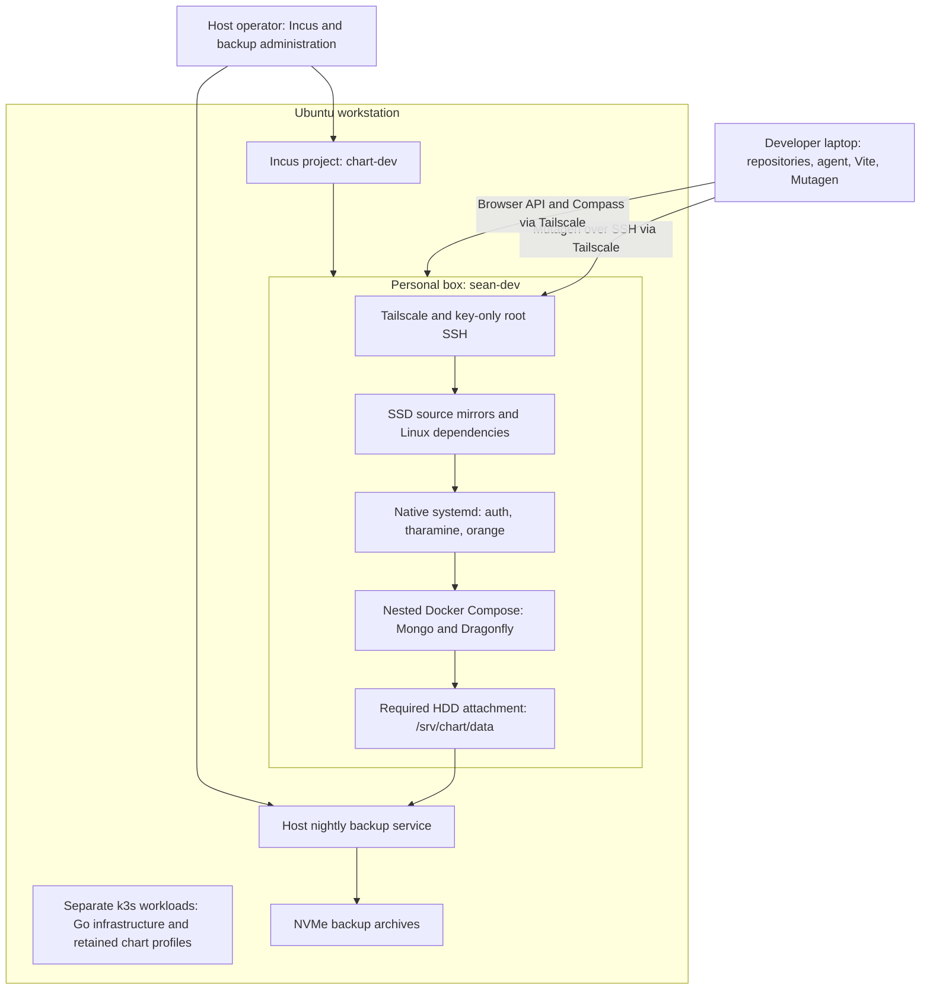
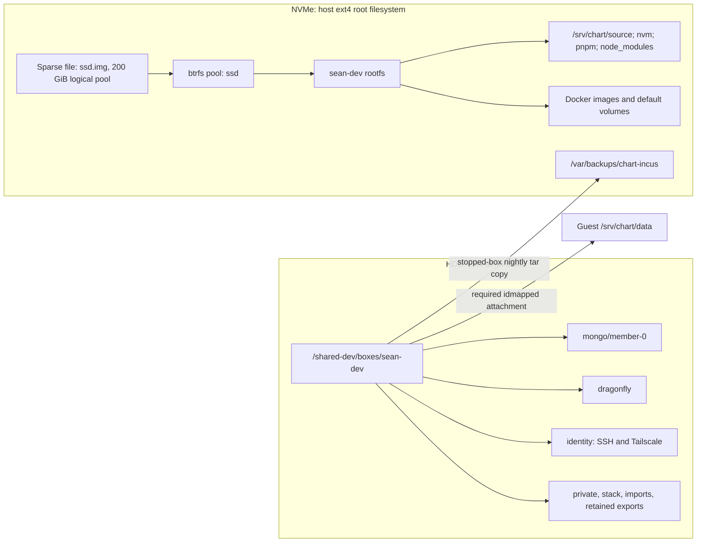
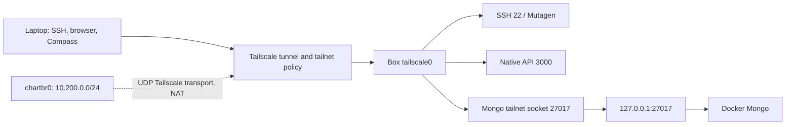
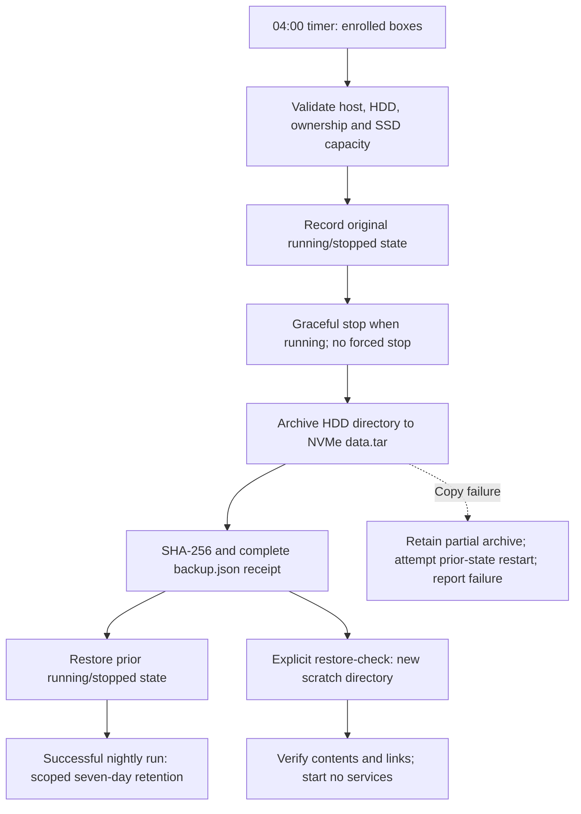

# Chart development setup

Chart-infra gives each developer an unprivileged Ubuntu system container on the
shared PC. The developer owns its applications and has root SSH inside it. The
host operator owns Incus, networking, images and backups. Laptop agents edit local
repositories and use Mutagen plus SSH to work with the box.

This guide describes the installed layout, including Sean's accepted box. The
installation snapshot is dated **2026-10-05**; inspect before acting on a resource.
The vault's [environment inventory](/home/sean/obsidian/vault/Chart%20Infra/chart-infra/001%20Environment%20Inventory.md),
[verification evidence](/home/sean/obsidian/vault/Chart%20Infra/chart-infra/002%20Verification%20and%20Evidence.md)
and [artifact inventory](/home/sean/obsidian/vault/Chart%20Infra/chart-infra/010%20Artifact%20Inventory%20and%20Cleanup.md)
hold exact identities, receipts, measurements and cleanup dispositions.

## System map



Incus system containers share the host kernel. Each has an isolated UID/GID map,
its own root filesystem and its own Tailscale identity. Guest root is not host
root. Developers receive no host Incus/Docker socket or kubeconfig.
No CPU/memory allocation, reservation or cap is configured per box.

The host is an i7-12700 with 12 cores/20 threads and 64 GB installed RAM
(about 61 GiB visible to Linux). Incus `6.0.5-8` comes from Ubuntu packages.
The accepted image is Ubuntu 26.04 with Docker 29.1.3, Compose 2.40.3,
Tailscale 1.102.4 and nvm 0.40.3. Exact infrastructure pins are in
[versions.lock.json](versions.lock.json) and [bare.lock.json](bare.lock.json).

## Instances and images

| Resource in project `chart-dev` | Role and retained state |
| --- | --- |
| `sean-dev` | Active developer box; running and checked over SSH on 2026-10-05. Tailnet IPv4 `100.76.252.100`; name `sean-dev.tail28bf29.ts.net`. Enrolled in nightly backups. |
| `sean-dev-pilot` | Retired application pilot; logged out of Tailscale and stopped in the operator's 2026-10-05 result. Original SSD rootfs, HDD directory and independent backup retained. |
| `chart-bare-bare-20261002` | Stopped builder for the accepted generic image; retained, not a developer environment or enrolled tailnet device. |
| `retained-1790943674288022288` | Stopped original rootfs from the recovery proof; its HDD was detached when the replacement adopted it. Never start it as a second identity copy. |
| `chart-test-bare-20261002-a` and `-b` | Disposable acceptance instances removed. HDD directories, exports and evidence retained. Tailnet admin removal is pending confirmation. |

The stopped-instance states above come from the operator's recorded listing;
this documentation pass did not obtain a new privileged Incus listing.
The pilot's tailnet registration also awaits admin removal. Logging out or deleting
an Incus instance does not remove its Tailscale device entry.

Accepted build: `bare-20261002`. Published image fingerprint:

```text
0d6270858c5ac848d53437f773cbc2b8b8385abae63ea56ba7cbaadb2c30a582
```

The image contains development tools, an empty source directory and unenrolled
SSH/Tailscale identity state. It contains no Node selection, repositories,
application images, database files or application credentials. Each developer
installs the project-required versions. Sean's accepted installation uses
Node 24.20.0, pnpm 11.24.0, Mongo 7.0.43 and Dragonfly 1.36.0.

Images and instances are different objects: retaining or removing the builder
does not by itself publish, replace or delete the image. Building another image
also does not upgrade existing boxes. See [image and lifecycle commands](IMAGES.md).

## Physical storage and mounts

The inspected PC has two separate filesystems. Its root is a direct ext4
partition, not an Ubuntu LVM logical volume.

| Layer | Path/device | Contents |
| --- | --- | --- |
| NVMe, nominal 1 TB | `/dev/nvme0n1p2`, ext4 at `/` | Ubuntu, host applications, Incus pool backing file and independent HDD backup archives |
| HDD, nominal 2 TB | `/dev/sda1`, ext4 at `/mnt/hdd` | Box data directories and separately retained k3s/application data |
| Incus pool `ssd` | Configured sparse btrfs file `/var/lib/incus/disks/ssd.img`; mounted at `/var/lib/incus/storage-pools/ssd` | Shared 200 GiB pool for instance rootfs/image storage; no disk repartitioning |
| Personal rootfs | Incus-managed container volume in `ssd` | OS, source, dependencies, Docker images/volumes and ordinary guest files |
| Box disk device `data` | Host `/mnt/hdd/shared-dev/boxes/<box>` → guest `/srv/chart/data` | Required, idmapped host-directory attachment; separate from the rootfs |
| Backup destination | Host `/var/backups/chart-incus` | HDD archives, explicit rootfs exports and scratch restore directories, outside the Incus pool |



The 200 GiB pool is shared by all boxes and images; it is not 200 GiB per box.
A guest `df /` reports the pool filesystem, not its own exclusive allocation.
The sparse pool file consumes host SSD blocks as data is written. Backups consume
additional host SSD space outside that pool. Neither an Incus snapshot nor a
rootfs export includes the attached HDD directory; copy that directory separately.

Incus checks machine/HDD identity, expected devices, isolated ID mapping and the
`.chart-incus-box.json` marker before lifecycle operations. Host numeric ownership
can differ from guest ownership through the idmapped attachment. Do not recursively
`chown` the HDD to make guest access work, or create an empty replacement directory
to bypass a missing mount.

## Inside Sean's active box

| Purpose | Guest location | Storage / owner |
| --- | --- | --- |
| Source mirrors | `/srv/chart/source/{auth-service-backend,tharamine-user-service,orange-v2-backend}` | SSD; source authored on laptop |
| Node tooling | `/opt/nvm` | SSD; developer-selected Node versions |
| pnpm store | `/root/.local/share/pnpm/store/v11` | SSD; measured for Sean, discover for other developers |
| Linux dependencies | Each repository's `node_modules` | SSD; installed inside the box, not synced from macOS |
| Compose definition | `/srv/chart/data/stack/compose.yaml` and private `.env` | HDD; developer-owned Compose project `chart` |
| Mongo files | `/srv/chart/data/mongo/member-0` → container `/data/db` | HDD bind mount |
| Mongo keyfile | `/srv/chart/data/private/mongo/keyfile` → container `/run/mongo/keyfile` | HDD; read-only inside Mongo |
| Dragonfly snapshots | `/srv/chart/data/dragonfly` → container `/data` | HDD bind mount |
| Application private config | `/srv/chart/data/private/<repo>/` | HDD; excluded source paths link to private files |
| npm credentials | `/srv/chart/data/private/npmrc`, linked from `/root/.npmrc` | HDD; private, never copy token values into docs |
| SSH/Tailscale identities | `/srv/chart/data/identity/{ssh,tailscale}` | HDD; preserves box identity through recreation |
| Active startup units | `/etc/systemd/system/` | SSD; developer-owned unit installation |
| Unit recovery copies | `/srv/chart/data/private/systemd/20261005T034156Z/` | HDD; five unit files, effective definitions and restore metadata |
| Mongo import and local maintenance copies | `/srv/chart/data/imports/`, `/srv/chart/data/backups/` | HDD; retained until explicit cleanup |

Mongo also has an anonymous Docker volume at `/data/configdb`. The inspected
volume is empty and lives under the guest `/var/lib/docker/volumes/` on SSD;
it is **outside nightly HDD backup coverage**. It is not the replica set's main
`/data/db` mount. Do not assume every Docker volume is on HDD. Before adding a
service, inspect its mounts and put durable data under `/srv/chart/data`.

Sean runs application watchers as enabled native systemd services:
`chart-auth`, `chart-tharamine` and `chart-orange`. Mongo and Dragonfly run in
Docker with `restart: unless-stopped`. This lets applications return when a
nightly backup restarts the box. Other developers choose their own supervisor;
the generic image does not install application startup units.

Mongo is an authenticated single-member `rs0` replica set with a retained keyfile.
There is no multi-member failover proof or infrastructure dataset-switch command.
Developers may organize their own named directories/volumes and select them in
their service configuration. Stopping or tearing down runtime must preserve
those directories unless deletion is explicitly requested.

## Networking and access

Each box joins the existing tailnet as its own device. Developers use their own
account for enrollment and their own SSH public key; API access follows tailnet
policy rather than SSH-account sharing. MagicDNS supplies the box name under
`tail28bf29.ts.net`. Mongo uses ordinary name/IP-and-port access, with no custom
DNS pilot, SRV lookup, resolver file, private CA or SNI proxy.

| Active endpoint | Purpose / reachability |
| --- | --- |
| `root@sean-dev:22` | Key-only SSH and Mutagen transport; guest root |
| `http://sean-dev:3000` | Orange API used by laptop Vite |
| `sean-dev:4001`, `sean-dev:5001` | Auth and Tharamine HTTP listeners |
| `sean-dev:27017` | Mongo socket proxy → guest `127.0.0.1:27017` → Docker Mongo |
| Guest `127.0.0.1:6379` | Dragonfly; no tailnet TCP proxy is configured |
| Guest ports `9091`, `9092`, `9093` | Additional backend listeners observed on all addresses; not hidden by the guest firewall from authorized tailnet peers |

Compass uses `directConnection=true` and the actual database user's `authSource`.
Retrieve credentials privately. The Mongo proxy uses `FreeBind=yes` so address
availability does not prevent its socket from starting. General browser HTTPS
needs separate certificate setup; the accepted browser path uses laptop Vite
and HTTP over Tailscale.



The host bridge is `chartbr0`, gateway `10.200.0.1`, with NAT Internet access.
Host rules isolate sibling bridge ports and reject private-network/host-management
access. The selected LAN has an exception for box UDP source port `41641` to allow
Tailscale direct connections; DERP remains fallback. This is a port-scoped exception,
not packet authentication. It does not expose application TCP ports on the LAN.

Guest input allows loopback, established traffic, DHCP replies, Tailscale transport
and traffic arriving on `tailscale0`. The host boundary also handles forwarded
Docker-published traffic. The guest input firewall does not restrict tailnet
traffic to a short application port list; tailnet ACLs govern peer access.
Native apps and SSH can listen on all guest addresses while underlay access is
blocked. Check Docker publications separately when changing a stack.

The host retains separate k3s workloads, including Go backing infrastructure,
TimescaleDB, Kafka, Minecraft/OpenScape and retained chart profiles. Repository
cleanup did not stop these or delete their PV/PVCs. They are not inside `sean-dev`,
are not covered by its backup, and are not managed by the personal-box tools.

## Source synchronization and private files

Mutagen 0.18.1 runs on the laptop and starts its remote agent through SSH; there is
no per-box Syncthing deployment. Each selected laptop checkout maps to a box source
directory. The laptop mapping records endpoints, owned sessions and policy;
Sean uses `~/.config/chart-box/sean-dev.json`.

Normal new source files sync without a Git commit. `.git`, dependencies and build
outputs stay excluded. Untracked secret-pattern files stay excluded, with the
helper's sample/example exceptions. Tracked private-pattern exceptions are
explicit policy: pause and refresh when their tracked status changes. Do not
silently import `.env.local` or keys as source. Agents review environment imports
privately using the [developer guide](DEVELOPER.md).

One-way-safe sync preserves conflicts instead of overwriting remote edits. Flush
and verify every affected repository before dependent remote tests or restarts.
A recreated box has empty SSD mirrors/dependencies; pause and reconcile sessions
before resuming. HDD data/identity retention does not restore source or packages.

## Backups and recovery

`chart-box-backup.timer` runs at **04:00 Asia/Kuala_Lumpur**. The installed service
uses root-owned code under `/var/lib/chart-incus/backup-tool/`, not a live import
from this checkout. Only explicitly enrolled personal boxes are selected;
`sean-dev` is enrolled. Builders, test boxes, retained rootfs instances and the
retired pilot are excluded. Missed runs do not catch up during the day.



| Material | Nightly HDD copy? | Recovery meaning |
| --- | --- | --- |
| Mongo main data, Dragonfly snapshots | Yes | Restore developer-owned database files from a stopped-box copy |
| HDD private config, keys, npmrc, identities | Yes | Private archive: treat as credentials and enrolled identity material |
| HDD unit copies, Compose files, imports, local exports | Yes | Restore installed units deliberately; copies are not automatically installed |
| Source, node_modules, nvm, pnpm store | No | Resync/reinstall or recover from a separately retained rootfs export |
| Active `/etc/systemd/system` files | No | Recover from their HDD copies; refresh copies after unit changes |
| Default Docker volumes, images and writable layers | No | Repull/rebuild; move durable service data to HDD |
| Host configuration, Incus database, k3s volumes | No | Separate host/workload recovery responsibility |

Archives live at `/var/backups/chart-incus/boxes/<UTC timestamp>/<box>/`.
Nightly copies contain `data.tar` and `backup.json`. A manual backup with
`--rootfs` also adds `rootfs.tar.gz`. Scratch checks use a separate new directory
under `/var/backups/chart-incus/restore-checks/`; they never restore over live data.
Checks validate archive hashes, contents and links. ACL/xattr metadata is archived,
but its complete restore behavior is not covered by the scratch content check.

Retention removes only completed nightly HDD-only copies older than seven days
when a newer completed copy exists. It does not guarantee exactly seven files.
Manual backups, rootfs exports, incomplete copies and scratch restores remain.
A failed nightly run skips pruning. No routine operation deletes retained HDD
source, import archives or stopped instances.

For recreation, the operator pauses laptop sync, backs up HDD and exports rootfs,
proves scratch restore, retains the old stopped instance, and attaches the original
HDD to a replacement from the verified image. SSH/Tailscale identities are reused.
Only one identity copy may run. Reinstall source/dependencies/application startup
on the replacement. Automatic rollback or arbitrary adoption after instance
loss is not implemented; inspect the recorded phase before manual recovery.

The first enabled backup-service invocation, scratch restore and app return passed
on 2026-10-05. The next timed run was scheduled for 2026-10-06 04:00 MYT at inspection;
its result is not claimed here. The independent NVMe copy protects against HDD
loss, not loss of the whole PC. Off-machine backup is not configured by these tools.

## Capacity, startup and operation

Observed 2026-10-05: host root about 56% used, HDD about 1% used, and the shared
200 GiB btrfs filesystem about 6% used. These values are measurements, not quotas.
Source/dependencies, Docker images, retained rootfs copies and archives can grow
independently. Review unexpected growth even below thresholds. Review at 70% pool
usage or below 25% host SSD free; pause optional heavy work at 85% pool use or
btrfs metadata pressure. Backup capacity checks preserve 25% free plus 1 GiB;
they cannot reserve space against concurrent workstation writes.

Host inotify settings are `max_user_instances=1024` and `max_user_watches=1048576`.
Box timezone follows the host, `Asia/Kuala_Lumpur`. Instance creation configures
`boot.autostart=false`: a host reboot does not automatically start every box.
Starting a box enables its infrastructure services; application return depends
on its developer-owned startup configuration.

From the host checkout, these are read-only inspections:

```sh
CHART_HOST_CONFIG=/home/sean/.local/state/chart-infra/incus-prep/host.json
sudo python3 incus/prep.py status --config "$CHART_HOST_CONFIG"
sudo incus list local: --project chart-dev
sudo incus storage volume list local:ssd --project chart-dev
systemctl status chart-box-backup.timer
journalctl -u chart-box-backup.service --no-pager -n 40
df -h / /mnt/hdd
```

Use [host preparation](README.md), [image/lifecycle/backup commands](IMAGES.md)
and [developer setup/daily use](DEVELOPER.md) for changes. Persistent staging and
retained artifacts belong in the vault inventory. Historical k3s/pilot code is
preserved at Git commit `edf394f`; it is not a supported deployment entry point.
