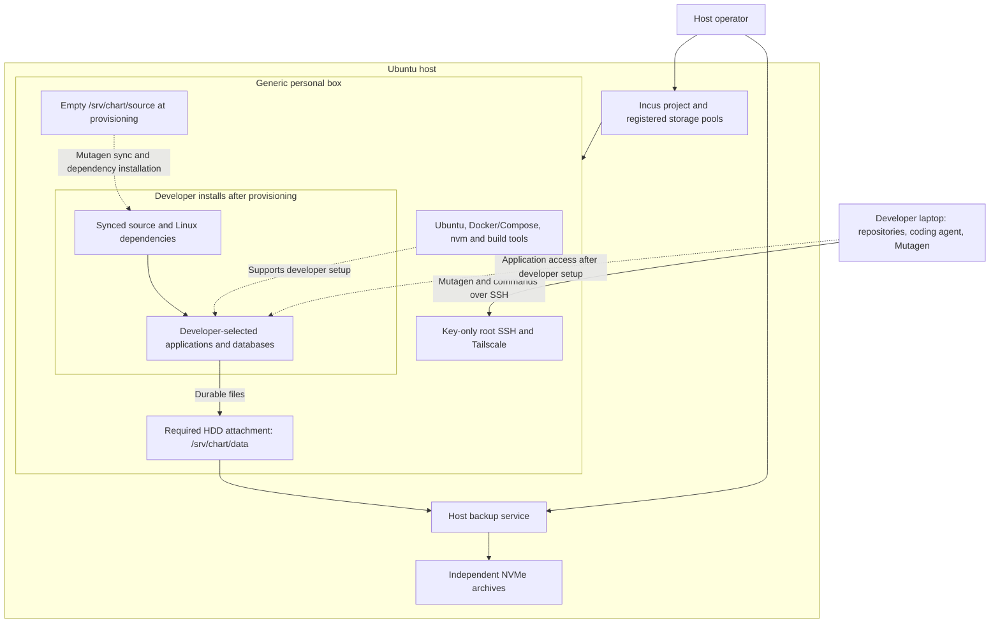
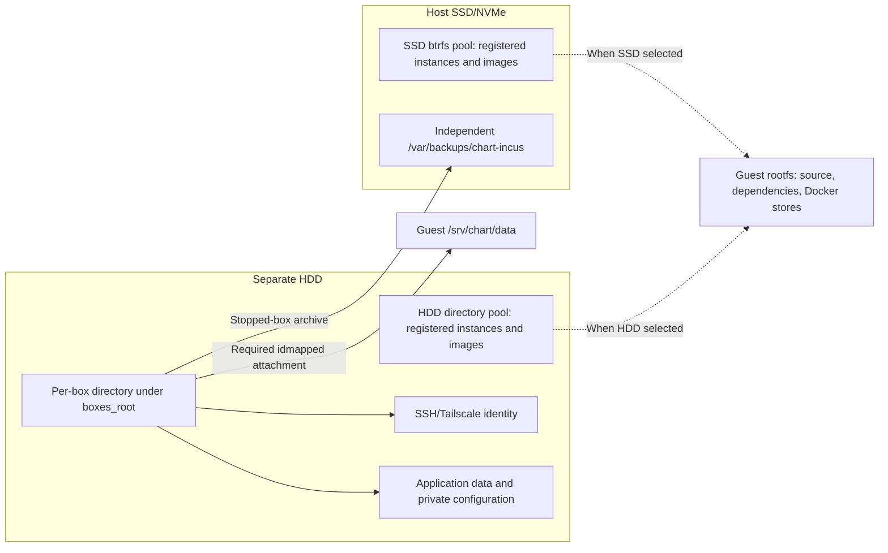
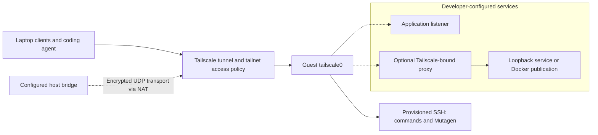
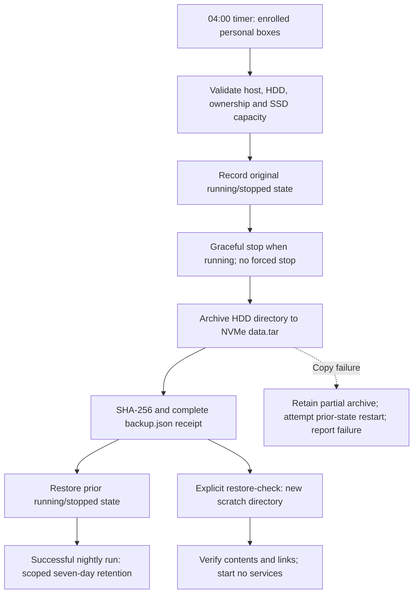

# Chart development architecture

Chart-infra supplies unprivileged Ubuntu system containers, SSH/Tailscale access,
a generic development image, laptop source sync and retained data backups.
The host operator owns Incus, networking, images and backups. Developers are root
inside their boxes and configure their own repositories, dependencies, applications,
databases, credentials and startup behavior. Application services are not in the image.

## System map

System containers share the host kernel, with isolated UID/GID maps, root filesystems
and SSH/Tailscale identities. Guest root is not host root; no host administration
socket or kubeconfig is provided. New boxes have an 8 GiB memory ceiling; memory
is consumed on demand, without a reservation. No CPU cap is set. Retained uncapped
boxes remain supported for backup and recovery until an operator applies the cap.

## Image and application boundary

The [operator guide](README.md#image-contents-and-preparation) owns image contents,
version pins, build acceptance and lifecycle commands. A freshly created box has
empty source and Docker stores. The developer uses their laptop agent to sync
checkouts, install project-selected runtimes, import private configuration and data,
and choose native processes, systemd or containers. See [developer setup](DEVELOPER.md).

An image build does not update deployed boxes. A builder, its published image and
instances created from it are separate resources. Recreation retains HDD data and
identity while providing a fresh rootfs; only one copy of an enrolled identity may run.

## Storage layers

| Layer | Location | Contents |
| --- | --- | --- |
| Host SSD/NVMe root | `/` | Host OS, Incus metadata, SSD pool backing file and independent backup archives |
| Host HDD | Configured `hdd_mount` | HDD rootfs pool and retained per-box data directories |
| SSD btrfs pool | `/var/lib/incus/disks/<pool>.img` | Sparse-file pool for instances/images assigned to the default SSD pool |
| HDD directory pool | `<hdd_mount>/shared-dev/incus` | Rootfs/image storage on the mounted ext4 HDD; ordinary copies rather than btrfs clones |
| Personal rootfs | Incus-managed volume in its registered pool | Guest OS, synced source, dependencies, Docker stores and ordinary guest files |
| Box disk device `data` | `<boxes_root>/<box>` → guest `/srv/chart/data` | Required idmapped attachment, retained independently of rootfs |
| Independent backups | Host `/var/backups/chart-incus` | Data-directory archives, explicit rootfs exports and scratch restores on SSD/NVMe |

Root placement follows the host configuration's default `pool` and per-name
`instance_pools`. The preparation template defaults to SSD; HDD placement requires
explicit registration. See [pool registration](README.md#pool-registration).
No preseed/profile/cloud-init configuration is part of this implementation.

The SSD sparse pool consumes host blocks as data is written. The HDD directory
pool shares its filesystem with attached data and needs capacity for copies.
Pool space is shared, not allocated per box. Removing an instance does not itself
measure how many host SSD blocks were reclaimed.

The `data` attachment is independent of rootfs: neither a rootfs snapshot nor a
rootfs export includes it. Lifecycle checks validate expected devices, isolated
ID mapping and `.chart-incus-box.json`. Host and guest numeric ownership can differ;
never recursively chown the HDD or substitute an empty directory for a missing mount.

## Guest files and volumes

| Purpose | Guest location | Responsibility and persistence |
| --- | --- | --- |
| Source mirrors | `/srv/chart/source/<repo>` | Developer selects and syncs repositories; registered root pool |
| Node version manager | `/opt/nvm` | Infrastructure installs nvm; developer installs Node versions; registered root pool |
| Dependencies and package caches | Project/tool-selected paths | Install inside the box; registered root pool; discover cache paths from the selected package manager |
| Docker images and default volumes | Docker-managed guest storage | Registered root pool unless explicitly configured otherwise |
| Box identities | `/srv/chart/data/identity/{ssh,tailscale}` | Infrastructure-managed HDD files retained through recreation |
| Application data | Developer-selected paths under `/srv/chart/data` | HDD; developer initializes services and imports data |
| Private configuration and credentials | Developer-selected private paths under `/srv/chart/data` | HDD; agent-reviewed imports, separate from synced source |
| Installed application startup units | `/etc/systemd/system/`, if systemd is selected | Developer-installed rootfs files |
| Recovery copies and imports | Developer-selected paths under `/srv/chart/data` | HDD; retain unit copies, configuration, dumps and restore instructions as needed |

A Docker named or anonymous volume uses guest Docker storage by default. Its name
does not put it in nightly backup coverage. Inspect every mount, including
image-declared volumes, and place durable data under `/srv/chart/data`.
Developers may select named directories or volumes in their own service definitions;
there is no infrastructure dataset-switch or application deployment command.

## Network and access boundary

Each box is a tailnet device enrolled under the developer's account. SSH requires
an authorized public key. Teammate API access follows tailnet policy independently
of SSH credentials. MagicDNS supplies box names when enabled. Browser HTTPS needs
separate certificate and application configuration.

The host bridge provides NAT Internet access and isolates underlay peer/private
networks. A selected-LAN UDP exception supports direct Tailscale transport, with
DERP fallback. Tailnet ACLs govern encrypted peer access; bridge rules cannot
filter inner tunnel destinations. [Firewall details](README.md#prepare-the-host)
include the exact exception and rule ordering.

Guest input allows Tailscale-interface traffic; it is not an application port
allowlist. Host enforcement also covers forwarded Docker ports. Developers
configure listeners; [a Tailscale-bound socket proxy](reference/tailnet-tcp.md)
can expose loopback services. Personal boxes have normal Internet egress with
developer-owned credentials. Unrelated host workloads retain their own policies
and are outside this lifecycle and backup system.

## Source synchronization

The laptop owns source and runs the coding agent. Mutagen uses SSH to mirror
selected checkouts; mappings record paths and owned sessions. The [chart-box skill](../skills/chart-box/SKILL.md)
selects the mapping and flushes affected repositories before dependent remote work.
The [developer guide](DEVELOPER.md#2-pair-repositories) owns exclusions, private-file
policy and recovery. Source/dependencies must be repopulated after recreation.

## Backup coverage

| Material | Nightly HDD copy? | Recovery meaning |
| --- | --- | --- |
| Application data placed under `/srv/chart/data` | Yes | Recover from a stopped-box copy using the application's restore requirements |
| HDD private config, keys and box identities | Yes | Treat archives as credentials and enrolled identity material |
| HDD unit copies, service definitions, imports and exports | Yes | Restore installed files deliberately; copies are not automatically installed |
| Rootfs source, dependencies and package caches | No | Resync/reinstall or use a separately retained rootfs export |
| Active `/etc/systemd/system` files | No | Recover from developer-maintained HDD copies |
| Default Docker volumes, images and writable layers | No | Repull/rebuild; place durable service data under `/srv/chart/data` |
| Host configuration, Incus database and unrelated workload volumes | No | Separate host/workload recovery responsibility |

Coverage follows the attachment, even if rootfs also lives on HDD. Enabled app
units and container restart policies determine application return after a box
starts; manually launched processes do not restart automatically. Keep recovery
copies of private configuration and startup definitions in the data attachment.

The [operator backup procedure](README.md#backups) owns schedule, enrollment,
retention, archive layout and restore checks. Copies on a separate host SSD protect
against HDD loss; off-machine recovery requires a separate backup arrangement.
No routine operation deletes developer data or retained recovery copies.

[Capacity checks](README.md#capacity-and-operator-checks) cover independent growth
of source, dependencies, images and archives. Deployment identities, artifact paths
and measurements belong in the operator's environment inventory, not this guide.
