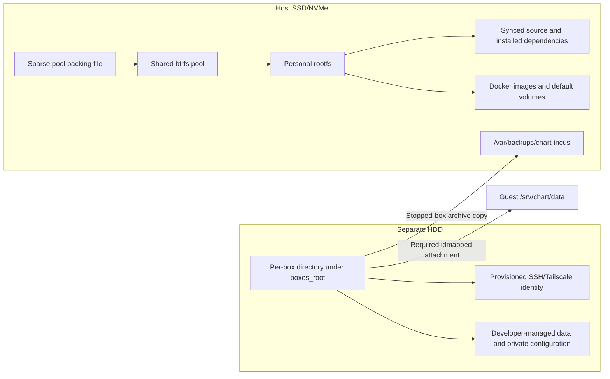
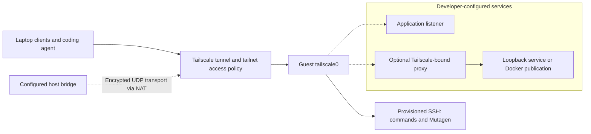
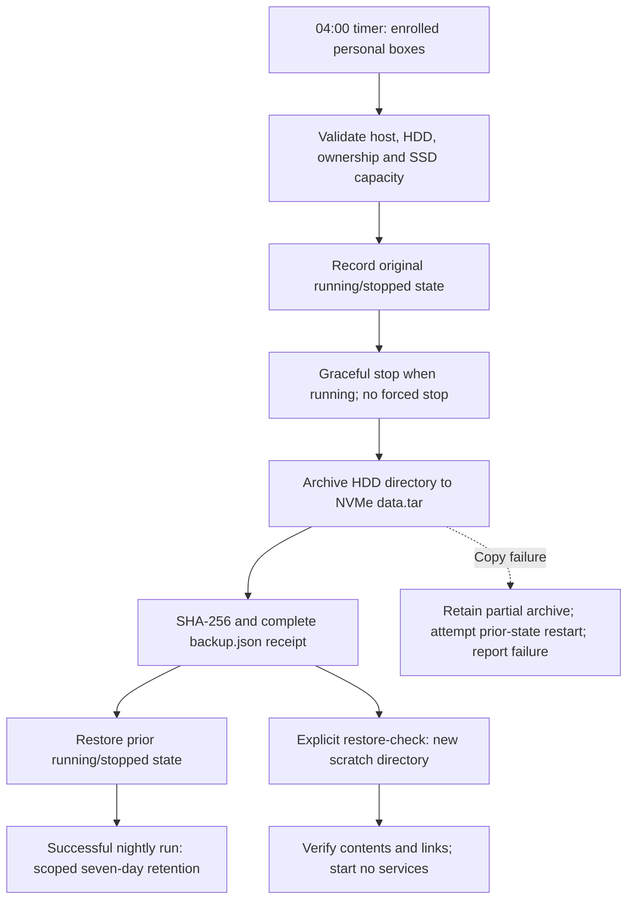

# Chart development architecture

Chart-infra supplies unprivileged Ubuntu system containers with development tools,
SSH, Tailscale connectivity and retained HDD storage. A freshly provisioned box
has an empty source directory. Developers use their laptop agents to sync source
with Mutagen, install dependencies, configure services and run their applications.

The host operator owns Incus, images, networking and backups. Developers have root
inside their boxes and own the application setup. Application source, databases,
private configuration and application startup units are not included in the image.

## System map


Incus system containers share the host kernel. Each has an isolated UID/GID map,
its own root filesystem and its own SSH/Tailscale identity. Guest root is not host
root. Developers receive no host Incus/Docker socket or kubeconfig. No per-box
CPU/memory reservation or cap is configured.

## Image, provisioning and application setup

| Stage | Infrastructure provides | Developer action |
| --- | --- | --- |
| Generic image | Ubuntu 26.04, Docker/Compose, nvm, build tools, Python, Git, SSH/Tailscale packages and guest firewall; empty source and Docker stores | None during image build |
| Box provisioning | Isolated rootfs, required HDD attachment, fresh SSH host keys, authorized public keys and host-matched timezone | Enroll the box in the team tailnet and verify SSH trust |
| Source setup | SSH transport and the laptop Mutagen helper | Select local checkouts and sync them to `/srv/chart/source/<repo>` |
| Application setup | Generic tools and storage | Install project-required runtimes/dependencies, supply private configuration, configure databases and choose startup behavior |
| Daily work | Connectivity, sync transport and enrolled HDD backups | Edit on the laptop, flush affected repositories, run commands in the box and maintain applications |

The image selects no Node version and contains no repositories, application
images, database files, application credentials or application service units.
Docker/Compose being installed does not mean an application stack is deployed.
Developers may use native processes, systemd or containers according to their
projects' requirements. Follow the [developer guide](DEVELOPER.md) for setup.

Exact infrastructure versions and artifact checksums are defined in
[versions.lock.json](versions.lock.json) and [bare.lock.json](bare.lock.json).
Use an explicitly verified image fingerprint when creating a box. Building an
image does not update existing instances. An image builder, its published image
and instances created from that image are separate resources.

Image acceptance uses disposable instances to verify runtime, identity, network
and recovery behavior. Retained rootfs copies and recovery archives are not
additional developer environments. Keep identity copies stopped and remove
tailnet registrations separately when retiring instances. Procedures are in
[image and lifecycle commands](IMAGES.md).

## Storage layers

Host preparation uses an SSD-backed root filesystem and a separate mounted HDD.
The host configuration binds operations to the machine, HDD UUID, mount, Incus
project, pool and bridge. Inspect the actual devices before preparation; do not
assume partition names or repartition disks.

| Layer | Location | Contents |
| --- | --- | --- |
| Host SSD/NVMe root | `/` | Host OS, Incus pool backing file and independent HDD backup archives |
| Host HDD | Configured `hdd_mount` | Retained per-box directories |
| Incus btrfs pool | `/var/lib/incus/disks/<pool>.img`, mounted under `/var/lib/incus/storage-pools/<pool>` | Shared sparse-file pool for instance rootfs and image storage |
| Personal rootfs | Incus-managed container volume in the pool | Guest OS, synced source, installed dependencies, Docker images/volumes and ordinary guest files |
| Box disk device `data` | `<boxes_root>/<box>` → guest `/srv/chart/data` | Required, idmapped host-directory attachment, separate from the rootfs |
| Independent backups | Host `/var/backups/chart-incus` | HDD archives, explicit rootfs exports and scratch restores, outside the Incus pool |

The supplied host layout uses `/mnt/hdd`, `/mnt/hdd/shared-dev/boxes` and a shared
200 GiB btrfs pool. This capacity belongs to the pool, not to each box. A guest
`df /` reports the pool filesystem, not an exclusive allocation. The sparse pool
file consumes host SSD blocks as data is written; archives consume additional
host SSD space outside the pool.



Neither an Incus rootfs snapshot nor a rootfs export includes the attached HDD
directory. Copy that directory separately. Host lifecycle tools validate expected
devices, isolated ID mapping and the `.chart-incus-box.json` marker. Host numeric
ownership can differ from guest ownership through the idmapped attachment. Do not
recursively `chown` the HDD or create an empty replacement to bypass a missing mount.

## Guest directories and application volumes

| Purpose | Guest location | Responsibility and persistence |
| --- | --- | --- |
| Source mirrors | `/srv/chart/source/<repo>` | Developer selects and syncs repositories; SSD |
| Node version manager | `/opt/nvm` | Infrastructure installs nvm; developer installs Node versions; SSD |
| Dependencies and package caches | Project/tool-selected paths | Install inside the box; SSD; discover cache paths from the selected package manager |
| Docker images and default volumes | Docker-managed guest storage | SSD unless explicitly configured otherwise |
| Box identities | `/srv/chart/data/identity/{ssh,tailscale}` | Infrastructure-managed HDD files retained through recreation |
| Application data | Developer-selected paths under `/srv/chart/data` | HDD; developer initializes services and imports data |
| Private configuration and credentials | Developer-selected private paths under `/srv/chart/data` | HDD; agent-reviewed imports, separate from synced source |
| Installed application startup units | `/etc/systemd/system/`, if systemd is selected | Developer-installed SSD files |
| Recovery copies and imports | Developer-selected paths under `/srv/chart/data` | HDD; retain unit copies, configuration, dumps and restore instructions as needed |

A Docker named or anonymous volume uses guest Docker storage by default; its name
does not place it on HDD. Inspect all service mounts, including image-declared
volumes. Bind durable data to `/srv/chart/data/<chosen-path>` or explicitly configure
a volume backed by that directory. Use required source paths so a missing data
mount cannot silently initialize a replacement database.

Developers choose database topology, authentication, versions, service names and
ports. They may organize named datasets as separate directories or volumes and
select them in their own service configuration. There is no infrastructure
application deployment or dataset-switch command. Runtime teardown must preserve
retained data unless deletion is explicitly requested.

Developers also configure application startup. An enabled systemd unit or an
appropriate container restart policy can restore a service when a box starts;
a manually launched process does not restart automatically. Keep recoverable unit
and configuration copies on HDD and refresh them when the installed files change.

## Networking and access

Each box joins the team tailnet as its own device. Developers enroll using their
own account and connect with their own SSH public key. Guest SSH is key-only root
access. Teammate application access follows tailnet policy independently of SSH
credentials. With MagicDNS enabled, clients can use the assigned box hostname.

Provisioning supplies SSH/Tailscale connectivity, not application endpoints.
Developers select service listeners and publish the endpoints their projects need.
A Tailscale-bound socket proxy to a loopback Docker publication is one supported
pattern; see the [TCP exposure example](reference/tailnet-tcp.md). Browser HTTPS
requires separate certificate and application configuration.



The host bridge provides NAT Internet access. Host rules isolate sibling bridge
ports and reject private-network/host-management access. The selected LAN has an
exception for box UDP source port `41641` to support direct Tailscale connections;
DERP remains fallback. This is a port-scoped exception, not packet authentication.
It does not expose application TCP ports on the LAN.

Guest input allows loopback, established traffic, DHCP replies, Tailscale transport
and traffic arriving on `tailscale0`. The host boundary also handles forwarded
Docker-published traffic. The guest input firewall does not limit tailnet traffic
to a predefined application port list; tailnet ACLs govern peer access. Check
listeners and Docker publications when configuring or changing a stack.

Unrelated host workloads and their storage are outside personal-box management
and backup coverage. Do not grant a box host administration to reach them.

## Source synchronization and private files

The laptop owns the source and runs the coding agent. Mutagen starts its remote
agent over SSH and mirrors each selected checkout to `/srv/chart/source/<repo>`.
Mappings under `~/.config/chart-box/` record endpoints, paths, owned sessions and
policy. Select the intended mapping explicitly; do not assume laptop paths.
Use the [chart-box skill](../skills/chart-box/SKILL.md) and its helper.

Ordinary new source files sync without a Git commit. `.git`, dependencies and build
outputs stay excluded. Untracked secret-pattern files stay excluded, with the
helper's sample/example exceptions. Tracked private-pattern exceptions are
explicit session policy: pause and refresh when their tracked status changes.
Agents review private environment/key imports using the [developer guide](DEVELOPER.md).

One-way-safe sync leaves conflicting remote edits for explicit resolution. Flush
and verify affected repositories before dependent remote tests or restarts.
A recreated box has empty SSD mirrors and dependencies; pause and reconcile
sessions before resuming. HDD retention does not restore source or packages.

## Backups and recovery

The backup policy is **04:00 Asia/Kuala_Lumpur, seven days of completed nightly
copies**. Installation of `chart-box-backup.timer` and enrollment of each personal
box are explicit operator operations. Creation does not enroll a box automatically.
The installed service uses a root-owned tool snapshot under
`/var/lib/chart-incus/backup-tool/`. Image builders, test instances and retained
recovery instances are excluded from automatic backup. Missed runs do not catch
up during the day.



| Material | Nightly HDD copy? | Recovery meaning |
| --- | --- | --- |
| Application data placed under `/srv/chart/data` | Yes | Recover from a stopped-box copy using the application's restore requirements |
| HDD private config, keys and box identities | Yes | Treat archives as credentials and enrolled identity material |
| HDD unit copies, service definitions, imports and exports | Yes | Restore installed files deliberately; copies are not automatically installed |
| SSD source, dependencies and package caches | No | Resync/reinstall or use a separately retained rootfs export |
| Active `/etc/systemd/system` files | No | Recover from developer-maintained HDD copies |
| Default Docker volumes, images and writable layers | No | Repull/rebuild; place durable service data on HDD |
| Host configuration, Incus database and unrelated workload volumes | No | Separate host/workload recovery responsibility |

Archives live at `/var/backups/chart-incus/boxes/<UTC timestamp>/<box>/`.
Nightly copies contain `data.tar` and `backup.json`. Manual `--rootfs` backups
also contain `rootfs.tar.gz`. Scratch checks extract into a new directory under
`/var/backups/chart-incus/restore-checks/`; they never overwrite live data.
They validate archive hashes, contents and links. ACL/xattr metadata is archived,
but its complete restore behavior is outside the scratch content check.

Retention removes only completed nightly HDD-only copies older than seven days
when a newer completed copy exists. Manual backups, rootfs exports, incomplete
copies and scratch restores remain. A failed nightly run skips pruning. Routine
operations do not delete retained source data, imports or stopped instances.

For recreation, coordinate a pause of laptop sync. The operator backs up HDD data,
exports rootfs, proves scratch restore, retains the old stopped instance and
attaches the original HDD to a replacement from a verified image. SSH/Tailscale
identities are reused; only one identity copy may run. The developer restores
source, dependencies and application startup. Automatic rollback and arbitrary
adoption after instance loss are outside this workflow; inspect the recorded
phase before manual recovery.

The independent NVMe copy protects against HDD loss, not loss of the whole host.
Off-machine backup requires a separate arrangement. See [backup and recovery
procedures](IMAGES.md) for commands, acceptance checks and failure handling.

## Capacity, startup and operation

Source, dependencies, Docker images, retained rootfs copies and archives grow
independently. Review unexpected growth even below thresholds. Review at 70% pool
usage or below 25% host SSD free; pause optional heavy work at 85% pool usage or
btrfs metadata pressure. Backup checks preserve 25% host-root free space plus
1 GiB; they cannot reserve space against concurrent host writes.

Host inotify settings are `max_user_instances=1024` and `max_user_watches=1048576`.
Box timezone follows the host. Instance creation sets `boot.autostart=false`:
a host reboot does not automatically start every box. Starting a box starts its
infrastructure services; application return depends on developer configuration.

From the host checkout, use the registered configuration for inspection:

```sh
CHART_HOST_CONFIG=/absolute/private/path/host.json
sudo python3 incus/prep.py status --config "$CHART_HOST_CONFIG"
systemctl status chart-box-backup.timer
journalctl -u chart-box-backup.service --no-pager -n 40
```

Use [host preparation](README.md), [image/lifecycle commands](IMAGES.md) and
[developer setup/daily use](DEVELOPER.md) for changes. Keep deployment identities,
capacity measurements, acceptance receipts and retained-artifact inventories in
the operator's environment records, separate from this reusable architecture.
